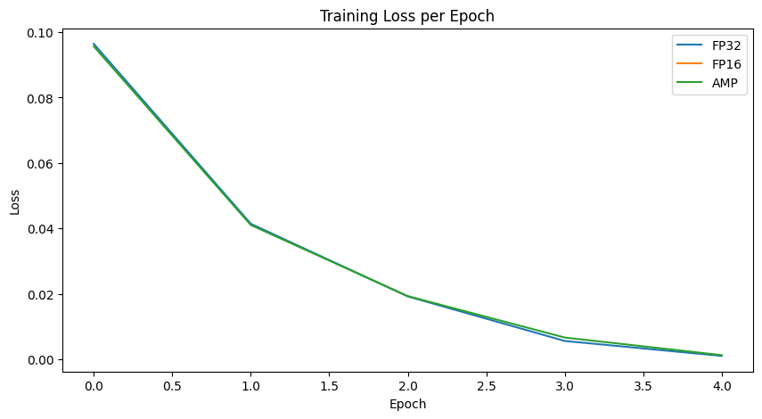
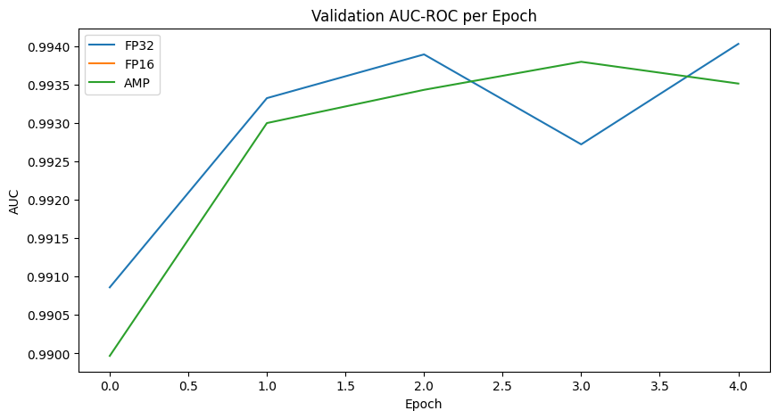

# Precision Comparison Experiment
This notebook compares FP32, FP16, and AMP for medical image classification.


```python
import sys
import os
sys.path.append('.')
from src.dataset import get_dataloaders
from src.model import get_model
from src.train import train_model
from src.utils import set_seed
import matplotlib.pyplot as plt
import pandas as pd
import torch
import numpy as np
import torchvision.transforms as transforms

device = 'cuda' if torch.cuda.is_available() else 'cpu'
print(f"Using device: {device}")

EPOCHS = 5
BATCH_SIZE = 32
LR = 1e-4

IMAGE_PATH = 'E:/'
TRAIN_CSV = 'E:/covidx/covidx_merged.csv'

transform = transforms.Compose([
    transforms.Resize((224, 224)),
    transforms.ToTensor(),
    transforms.Normalize(mean=[0.485, 0.456, 0.406], std=[0.229, 0.224, 0.225]),
])

results = {}
```

    Using device: cuda
    


```python
# FP32 Training
set_seed(42)
train_loader, val_loader, test_loader = get_dataloaders(
    csv_file=TRAIN_CSV, 
    root_dir=IMAGE_PATH, 
    batch_size=BATCH_SIZE, 
    transform=transform
)
model_fp32 = get_model(num_classes=2, pretrained=True)
print("\n--- Starting FP32 Training ---")
model_fp32, history_fp32, peak_mem_fp32 = train_model(
    model_fp32, train_loader, val_loader, 
    precision='fp32', epochs=EPOCHS, lr=LR, device=device
)
results['fp32'] = {'history': history_fp32, 'peak_memory': peak_mem_fp32}
```

    2026-02-28 17:01:14,211 - src.dataset - INFO - Original samples: 67863
    2026-02-28 17:01:14,212 - src.dataset - INFO - Valid AP/PA samples: 53691
    2026-02-28 17:01:14,218 - src.dataset - INFO - Loaded 53691 samples for split 'train'
    2026-02-28 17:01:14,226 - src.dataset - INFO - Class distribution: PA=20388, AP=33303
    2026-02-28 17:01:14,353 - src.dataset - INFO - Original samples: 8473
    2026-02-28 17:01:14,353 - src.dataset - INFO - Valid AP/PA samples: 4186
    2026-02-28 17:01:14,354 - src.dataset - INFO - Loaded 4186 samples for split 'val'
    2026-02-28 17:01:14,356 - src.dataset - INFO - Class distribution: PA=1275, AP=2911
    2026-02-28 17:01:14,482 - src.dataset - INFO - Original samples: 8482
    2026-02-28 17:01:14,483 - src.dataset - INFO - Valid AP/PA samples: 7143
    2026-02-28 17:01:14,484 - src.dataset - INFO - Loaded 7143 samples for split 'test'
    2026-02-28 17:01:14,485 - src.dataset - INFO - Class distribution: PA=3406, AP=3737
    
    --- Starting FP32 Training ---
    

    Epoch 1/5 [Train]: 100%|██████████| 1678/1678 [03:29<00:00,  8.02it/s]
    Epoch 1/5 [Eval]: 100%|██████████| 131/131 [00:18<00:00,  7.19it/s]

    2026-02-28 17:05:02,283 - src.train - INFO - Epoch 1/5 - Train Loss: 0.0964 - Val Loss: 0.1288 - Val AUC: 0.9909 - Time: 227.48s
    

    
    Epoch 2/5 [Train]: 100%|██████████| 1678/1678 [03:26<00:00,  8.12it/s]
    Epoch 2/5 [Eval]: 100%|██████████| 131/131 [00:18<00:00,  7.22it/s]

    2026-02-28 17:08:47,183 - src.train - INFO - Epoch 2/5 - Train Loss: 0.0414 - Val Loss: 0.1018 - Val AUC: 0.9933 - Time: 224.90s
    

    
    Epoch 3/5 [Train]: 100%|██████████| 1678/1678 [03:26<00:00,  8.12it/s]
    Epoch 3/5 [Eval]: 100%|██████████| 131/131 [00:18<00:00,  7.23it/s]

    2026-02-28 17:12:32,055 - src.train - INFO - Epoch 3/5 - Train Loss: 0.0192 - Val Loss: 0.1066 - Val AUC: 0.9939 - Time: 224.87s
    

    
    Epoch 4/5 [Train]: 100%|██████████| 1678/1678 [03:25<00:00,  8.15it/s]
    Epoch 4/5 [Eval]: 100%|██████████| 131/131 [00:18<00:00,  7.22it/s]

    2026-02-28 17:16:16,101 - src.train - INFO - Epoch 4/5 - Train Loss: 0.0056 - Val Loss: 0.1579 - Val AUC: 0.9927 - Time: 224.05s
    

    
    Epoch 5/5 [Train]: 100%|██████████| 1678/1678 [03:25<00:00,  8.15it/s]
    Epoch 5/5 [Eval]: 100%|██████████| 131/131 [00:18<00:00,  7.21it/s]

    2026-02-28 17:20:00,163 - src.train - INFO - Epoch 5/5 - Train Loss: 0.0010 - Val Loss: 0.1465 - Val AUC: 0.9940 - Time: 224.06s
    2026-02-28 17:20:00,164 - src.train - INFO - Peak GPU Memory for fp32: 2955.80 MB
    

    
    


```python
# FP16 (Pure) Training
set_seed(42)
model_fp16 = get_model(num_classes=2, pretrained=True)
print("\n--- Starting Pure FP16 Training ---")
model_fp16, history_fp16, peak_mem_fp16 = train_model(
    model_fp16, train_loader, val_loader, 
    precision='fp16', epochs=EPOCHS, lr=LR, device=device
)
results['fp16'] = {'history': history_fp16, 'peak_memory': peak_mem_fp16}
```

    
    --- Starting Pure FP16 Training ---
    

    Epoch 1/5 [Train]: 100%|██████████| 1678/1678 [02:04<00:00, 13.48it/s]
    Epoch 1/5 [Eval]: 100%|██████████| 131/131 [00:17<00:00,  7.34it/s]

    2026-02-28 17:22:22,828 - src.train - INFO - Epoch 1/5 - Train Loss: nan - Val Loss: nan - Val AUC: nan - Time: 142.39s
    

    
    Epoch 2/5 [Train]: 100%|██████████| 1678/1678 [02:03<00:00, 13.54it/s]
    Epoch 2/5 [Eval]: 100%|██████████| 131/131 [00:17<00:00,  7.38it/s]

    2026-02-28 17:24:44,560 - src.train - INFO - Epoch 2/5 - Train Loss: nan - Val Loss: nan - Val AUC: nan - Time: 141.73s
    

    
    Epoch 3/5 [Train]: 100%|██████████| 1678/1678 [02:04<00:00, 13.51it/s]
    Epoch 3/5 [Eval]: 100%|██████████| 131/131 [00:17<00:00,  7.30it/s]

    2026-02-28 17:27:06,749 - src.train - INFO - Epoch 3/5 - Train Loss: nan - Val Loss: nan - Val AUC: nan - Time: 142.19s
    

    
    Epoch 4/5 [Train]: 100%|██████████| 1678/1678 [02:03<00:00, 13.56it/s]
    Epoch 4/5 [Eval]: 100%|██████████| 131/131 [00:17<00:00,  7.35it/s]

    2026-02-28 17:29:28,393 - src.train - INFO - Epoch 4/5 - Train Loss: nan - Val Loss: nan - Val AUC: nan - Time: 141.64s
    

    
    Epoch 5/5 [Train]: 100%|██████████| 1678/1678 [02:04<00:00, 13.52it/s]
    Epoch 5/5 [Eval]: 100%|██████████| 131/131 [00:17<00:00,  7.35it/s]

    2026-02-28 17:31:50,381 - src.train - INFO - Epoch 5/5 - Train Loss: nan - Val Loss: nan - Val AUC: nan - Time: 141.99s
    2026-02-28 17:31:50,381 - src.train - INFO - Peak GPU Memory for fp16: 1729.32 MB
    

    
    


```python
# AMP Training
set_seed(42)
model_amp = get_model(num_classes=2, pretrained=True)
print("\n--- Starting AMP Training ---")
model_amp, history_amp, peak_mem_amp = train_model(
    model_amp, train_loader, val_loader, 
    precision='amp', epochs=EPOCHS, lr=LR, device=device
)
results['amp'] = {'history': history_amp, 'peak_memory': peak_mem_amp}
```

    d:\Projects\ML_Algorithms\float_comparison_dl\src\train.py:107: FutureWarning: `torch.cuda.amp.GradScaler(args...)` is deprecated. Please use `torch.amp.GradScaler('cuda', args...)` instead.
      scaler = GradScaler() if precision == 'amp' else None
    

    
    --- Starting AMP Training ---
    

    Epoch 1/5 [Train]: 100%|██████████| 1678/1678 [02:01<00:00, 13.85it/s]
    Epoch 1/5 [Eval]: 100%|██████████| 131/131 [00:17<00:00,  7.34it/s]

    2026-02-28 17:34:09,671 - src.train - INFO - Epoch 1/5 - Train Loss: 0.0957 - Val Loss: 0.1328 - Val AUC: 0.9900 - Time: 139.05s
    

    
    Epoch 2/5 [Train]: 100%|██████████| 1678/1678 [02:03<00:00, 13.60it/s]
    Epoch 2/5 [Eval]: 100%|██████████| 131/131 [00:18<00:00,  7.22it/s]

    2026-02-28 17:36:31,234 - src.train - INFO - Epoch 2/5 - Train Loss: 0.0411 - Val Loss: 0.1037 - Val AUC: 0.9930 - Time: 141.56s
    

    
    Epoch 3/5 [Train]: 100%|██████████| 1678/1678 [02:03<00:00, 13.64it/s]
    Epoch 3/5 [Eval]: 100%|██████████| 131/131 [00:17<00:00,  7.32it/s]

    2026-02-28 17:38:52,225 - src.train - INFO - Epoch 3/5 - Train Loss: 0.0193 - Val Loss: 0.0983 - Val AUC: 0.9934 - Time: 140.99s
    

    
    Epoch 4/5 [Train]: 100%|██████████| 1678/1678 [02:01<00:00, 13.76it/s]
    Epoch 4/5 [Eval]: 100%|██████████| 131/131 [00:17<00:00,  7.32it/s]

    2026-02-28 17:41:12,091 - src.train - INFO - Epoch 4/5 - Train Loss: 0.0067 - Val Loss: 0.1312 - Val AUC: 0.9938 - Time: 139.87s
    

    
    Epoch 5/5 [Train]: 100%|██████████| 1678/1678 [02:02<00:00, 13.73it/s]
    Epoch 5/5 [Eval]: 100%|██████████| 131/131 [00:17<00:00,  7.33it/s]

    2026-02-28 17:43:32,176 - src.train - INFO - Epoch 5/5 - Train Loss: 0.0013 - Val Loss: 0.1374 - Val AUC: 0.9935 - Time: 140.08s
    2026-02-28 17:43:32,177 - src.train - INFO - Peak GPU Memory for amp: 2003.46 MB
    

    
    


```python
# Visualization and Results
summary = []
for precision in ['fp32', 'fp16', 'amp']:
    h = results[precision]['history']
    summary.append({
        'Precision': precision.upper(),
        'Avg Time/Epoch (s)': sum(h['epoch_times'])/len(h['epoch_times']),
        'Total Time (s)': sum(h['epoch_times']),
        'Peak Memory (MB)': results[precision]['peak_memory'],
        'Final Val Acc': h['val_acc'][-1],
        'Final Val AUC': h['val_auc'][-1],
        'Final Val F1': h['val_f1'][-1]
    })

df = pd.DataFrame(summary)
display(df)
df.to_csv('results_summary.csv', index=False)

plt.figure(figsize=(10, 5))
for p in ['fp32', 'fp16', 'amp']:
    plt.plot(results[p]['history']['train_loss'], label=p.upper())
plt.title('Training Loss per Epoch')
plt.xlabel('Epoch')
plt.ylabel('Loss')
plt.legend()
plt.savefig('train_loss.png')
plt.show()

plt.figure(figsize=(10, 5))
for p in ['fp32', 'fp16', 'amp']:
    plt.plot(results[p]['history']['val_auc'], label=p.upper())
plt.title('Validation AUC-ROC per Epoch')
plt.xlabel('Epoch')
plt.ylabel('AUC')
plt.legend()
plt.savefig('val_auc.png')
plt.show()
```


<div>
<style scoped>
    .dataframe tbody tr th:only-of-type {
        vertical-align: middle;
    }

    .dataframe tbody tr th {
        vertical-align: top;
    }

    .dataframe thead th {
        text-align: right;
    }
</style>
<table border="1" class="dataframe">
  <thead>
    <tr style="text-align: right;">
      <th></th>
      <th>Precision</th>
      <th>Avg Time/Epoch (s)</th>
      <th>Total Time (s)</th>
      <th>Peak Memory (MB)</th>
      <th>Final Val Acc</th>
      <th>Final Val AUC</th>
      <th>Final Val F1</th>
    </tr>
  </thead>
  <tbody>
    <tr>
      <th>0</th>
      <td>FP32</td>
      <td>225.072235</td>
      <td>1125.361176</td>
      <td>2955.795898</td>
      <td>0.970139</td>
      <td>0.994028</td>
      <td>0.965067</td>
    </tr>
    <tr>
      <th>1</th>
      <td>FP16</td>
      <td>141.988765</td>
      <td>709.943825</td>
      <td>1729.317383</td>
      <td>0.695413</td>
      <td>NaN</td>
      <td>0.410173</td>
    </tr>
    <tr>
      <th>2</th>
      <td>AMP</td>
      <td>140.310193</td>
      <td>701.550967</td>
      <td>2003.462891</td>
      <td>0.972050</td>
      <td>0.993512</td>
      <td>0.967247</td>
    </tr>
  </tbody>
</table>
</div>


    

    


    

    

